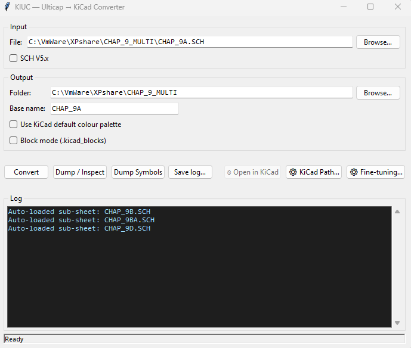
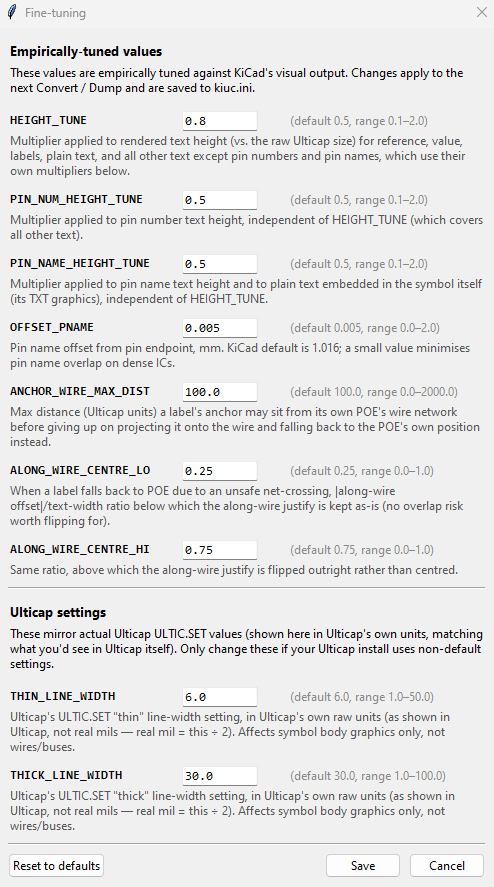
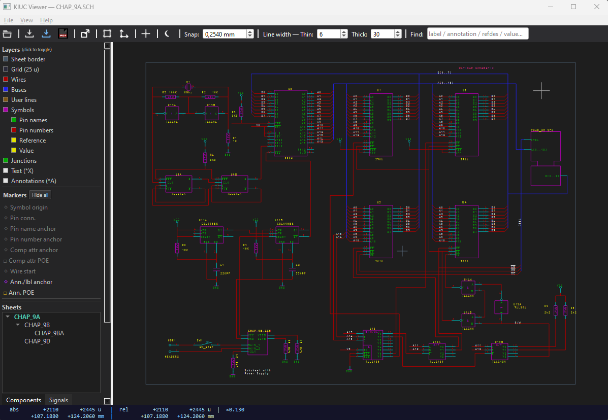
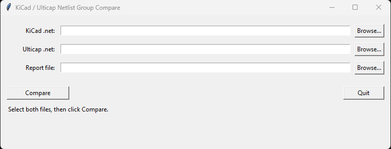
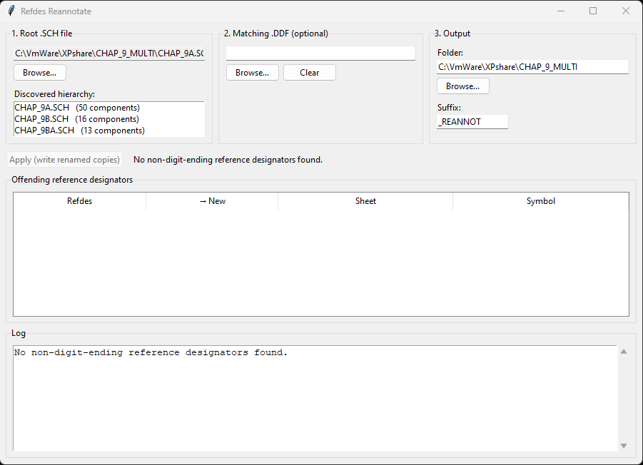

# Ulticap SCH to KiCad Converter (KIUC)
**Python:** 3.9+ | **License:** GPLv3 | **Target:** KiCad 9

><ins>**Legal Notice**</ins>\
[KIUC](https://github.com/Snieffy/ulticap-sch-to-kicad-converter) is a functional acronym for <ins>**Ki**</ins>Cad <ins>**U**</ins>lti<ins>**C**</ins>ap Converter.\
This is an independent, open-source project and is not affiliated with, sponsored by, or endorsed by any companies sharing a similar name.\
[Ulticap](https://www.ni.com/) is a product of National Instruments (formerly Ultimate Technology / Electronics Workbench).\
[KiCad](https://www.kicad.org/) is a free software suite for electronic design automation.\
This tool is provided "as-is" for file migration purposes only.

KIUC converts Ulticap ASCII schematic files (`.SCH` / `.BLK`) to KiCad 9 schematic format (`.kicad_sch`).\
It is the schematic counterpart to [KIUB](https://github.com/Snieffy/ultiboard-ddf-to-kicad-converter),
which converts Ultiboard layout files to KiCad PCB format.

---

## License & Originality

This project is licensed under the **GNU General Public License v3.0 (GPLv3)**.

This software is an original work. No Ulticap source code, proprietary algorithms, or confidential
materials were used or referenced in its development. The implementation is based entirely on
independent analysis of publicly observable file format behaviour and the 1997 Ulticap reference manual.

### Development History

- **Primary Research:**\
  The core parsing logic and technical specifications are derived from the\
  **Ulticap 32-bit DOS and Windows 95 — Reference Manual (1997-08-07)**,\
  supplemented by extensive empirical testing against real Ulticap schematic files spanning V1.50 through V5.72.\
  A full reverse-engineered description of the ASCII SCH file format is provided in [FILEFORMAT.md](FILEFORMAT.md).
- **Modern Implementation:**\
  KIUC is an independent Python implementation, developed entirely from scratch.\
  It shares no code, no algorithms, and no internal structures with Ulticap or any related software.
- **Independent Logic:**\
  All format details not documented in the reference manual were determined by direct observation\
  of file output across the supported version range.

---

## Key Features

- Converts Ulticap ASCII `.SCH` and `.BLK` files to KiCad 9 `.kicad_sch`
- Supports the full range of tested versions: V1.50 through V5.72
- Handles single-sheet and multi-sheet hierarchical designs, auto-discovering sub-sheets from the selected main sheet
- Preserves wires, buses, junctions, net labels, annotations, and free text
- Converts symbol shapes, pin definitions, and component placements
- Translates component reference/value text alignment and visibility
- Converts the Ulticap title block as an on-sheet symbol, and populates KiCad's title block fields
- Handles named-stub power symbols (see [NAMED_STUB.md](NAMED_STUB.md))
- Built-in schematic viewer with layer toggling and SVG / PDF / PNG export
- Block mode: converts `.BLK` files to KiCad block libraries (`.kicad_blocks`)
- Netlist comparison utility: KiCad `.net` vs Ulticap `.net`
- Reference designator re-annotation utility



---

## Requirements

- Python 3.9 or later
- tkinter (required for the converter GUI, Refdes Reannotate, and Netlist Compare)
- PySide6 (required for the schematic viewer only)
- KiCad 9

The command-line converter (`kiuc.py`) has no GUI dependencies at all.

tkinter ships with the standard Python installer on Windows and macOS. On Linux it is usually a
separate package:

```
sudo apt install python3-tk
```

Install PySide6 if not already present:

```
pip install PySide6
```

No further installation step is required beyond the above. Download or clone the repository and run
directly from the source folder.

---

## Usage

### GUI

Launch the converter GUI:

```
python kiuc_gui.py
```

**Input file**\
Select the main (parent) `.SCH` sheet of your design in the **File** field, either by typing/pasting
the path or via **Browse…**. For multi-sheet hierarchical designs, KIUC automatically discovers and
loads every sub-sheet referenced from the selected file, recursively — no need to add child sheets
by hand, and no way to accidentally mix sheets from a second, unrelated design into the same
conversion. Each auto-loaded sub-sheet is reported in the log; if a referenced sub-sheet can't be
found on disk, a warning is logged there too. Block mode (`.BLK`) is never hierarchical, so
auto-discovery does not apply to it.

**Output**\
Set the **Folder** for the converted output files. The **Base name** field controls the stem of
the generated `.kicad_sch`, `.kicad_pro`, and `.kicad_wks` files; when left empty it is derived
from the first input file.

**Options**

| Option⠀⠀⠀⠀| Description |
| --- | --- |
| **SCH V5.x** | Rewrites the SCH version header to V5.00 **in-place** before parsing. Use when a V5.72 UTSCH file was saved in SCH format and is being mis-identified as an earlier version. Arc encoding differs, so a mis-identified file will produce incorrect arc rendering in the converted output. A bug in Ulticap 5.72 causes each open/save of the same SCH file to 'fix' the arc rendering over and over again, resulting in an unrecoverable arc misalignment. This is only an aesthetic problem and has no influence on the connectivity.|
| **Use KiCad default colour palette** | Disables Ulticap's measured colour palette. All schematic items inherit their colour from the active KiCad theme. |
| **Block mode** | Converts input files to a KiCad block library (`.kicad_blocks`) instead of a schematic project. The `.kicad_pro` and `.kicad_wks` files are not written, and title block symbols are suppressed. |

**Actions**

| Button⠀⠀⠀⠀⠀⠀⠀⠀⠀⠀⠀| Description |
| --- | --- |
| **Convert** | Run the conversion and write output files to the selected folder. |
| **Dump / Inspect** | Print a parsed data summary to the log without writing any output files. Useful for inspecting file content before converting. |
| **Dump Symbols** | List all symbol names and their attributes in the log. Useful for identifying title block symbols and similar special-purpose symbols. |
| **Save log...** | Save the current log contents to a text file. |
| **Open in KiCad** | Open the converted project directly in KiCad. **Important:** the KiCad path must point to the KiCad **Project Manager** executable (`kicad.exe`), not the Schematic Editor. KIUC generates a `.kicad_pro` project file, and the Open in KiCad button relies on this file. Pointing to the Schematic Editor instead will result in an error. Set the path using the **KiCad Path...** button. |
| **KiCad Path...** | Set and save the path to the KiCad Project Manager executable. |
| **Fine-tuning...** | Opens the Fine-tuning dialog (see below). |

**Reference designators**\
When the converter detects reference designators that do not end in a digit (e.g. `R1A`, `U2B`),
KiCad will treat these as unannotated. KIUC will propose to launch the **Refdes Reannotate** utility
automatically. If accepted, Refdes Reannotate creates renamed copies of the entire SCH hierarchy with
a `_REANNOT` suffix, and if a sibling `.DDF` file is present, a renamed copy of that file is created
as well. The conversion then proceeds using the reannotated SCH copies. The DDF file is not converted
by KIUC — use [KIUB](https://github.com/Snieffy/ultiboard-ddf-to-kicad-converter) to convert it separately.

**Fine-tuning**\
The Fine-tuning dialog adjusts rendering parameters. It groups them into two sections: values
empirically tuned against KiCad's visual output, and values that mirror an actual Ulticap
`ULTIC.SET` setting (only relevant if your own Ulticap install uses non-default settings).
Changes take effect on the next conversion or dump and are saved to `kiuc.ini`.



*Empirically-tuned values*

| Parameter⠀⠀⠀⠀⠀⠀⠀⠀| Default | Description |
| --- | :---: | --- |
| **HEIGHT_TUNE** | 0.5 | Multiplier applied to rendered text height vs. the raw Ulticap size, for reference, value, labels, plain text outside symbols, and all other text except pin numbers, pin names, and plain text embedded in a symbol, which use their own multipliers below. |
| **PIN_NUM_HEIGHT_TUNE** | 0.5 | Multiplier applied to pin number text height, independent of HEIGHT_TUNE. |
| **PIN_NAME_HEIGHT_TUNE** | 0.5 | Multiplier applied to pin name text height and to plain text embedded in the symbol itself, independent of HEIGHT_TUNE. |
| **OFFSET_PNAME** | 0.005 | Pin name offset from pin endpoint, in mm. A small value minimises pin name overlap on dense ICs. |
| **ANCHOR_WIRE_MAX_DIST** | 100.0 | Max distance (Ulticap units) a label's anchor may sit from its own POE's wire/bus network before giving up on projecting it onto the wire and falling back to the POE's own position instead. |
| **ALONG_WIRE_CENTRE_LO** | 0.25 | When a label falls back to POE due to an unsafe net-crossing, offset/text-width ratio below which the along-wire justify is kept as-is. |
| **ALONG_WIRE_CENTRE_HI** | 0.75 | Same ratio, above which the along-wire justify is flipped outright rather than centred. |

*Ulticap settings*

| Parameter⠀⠀⠀⠀⠀⠀⠀⠀| Default | Description |
| --- | :---: | --- |
| **THIN_LINE_WIDTH** | 6.0 | Ulticap's `ULTIC.SET` "thin" line-width setting, in Ulticap's own raw units (as shown in Ulticap, not real mils — real mil = this ÷ 2). Affects symbol body graphics only, not wires/buses. |
| **THICK_LINE_WIDTH** | 30.0 | Ulticap's `ULTIC.SET` "thick" line-width setting, in Ulticap's own raw units (as shown in Ulticap, not real mils — real mil = this ÷ 2). Affects symbol body graphics only, not wires/buses. |

---

### Command Line

```
python kiuc.py input.SCH -o output/
```

**Hierarchical design (sub-sheets discovered automatically):**

```
python kiuc.py parent.SCH -o output/
```

| Option⠀⠀⠀⠀⠀⠀⠀⠀⠀| Description |
|---|---|
| `input` | `.SCH` or `.BLK` input file(s). For a hierarchical design, give just the main (parent) sheet — sub-sheets are discovered and added automatically. Extra files can still be listed explicitly if needed, e.g. sheets living in another folder. |
| `-o` / `--out` | Output directory. Default: current directory. |
| `-n` / `--name` | Base name for output files. Default: derived from the first input file. |
| `--block` | Convert to a KiCad block library (`.kicad_blocks`) instead of a schematic project. |
| `--lib-name` | Block library name. Default: stem of the first input file. Only used with `--block`. |
| `--v5` | Rewrite the SCH version header to V5.00 in-place before parsing. Use for V5.x files saved in old format. **Warning:** modifies each input file in-place. |
| `--kicad-colors` | Use KiCad's default colour theme instead of Ulticap's measured colour palette. |
| `--fix-refdes` | Automatically create reannotated `_REANNOT` copies of the SCH hierarchy when reference designators not ending in a digit are found, and convert those copies. Non-interactive: always applies the fix without prompting. Without this flag, an affected design is converted unchanged and a warning is printed. |
| `--ddf` | Path to the matching `.DDF` file, used together with `--fix-refdes` to also create a reannotated copy of the DDF file. If omitted, a same-named `.DDF` next to the first input `.SCH` file is used automatically if one exists. |
| `--dump` | Print a parsed data summary without writing output files. |
| `--dump-symbols` | Print all symbol names and attributes. |

---

### Viewer

The built-in viewer renders Ulticap `.SCH` and `.BLK` files directly, without converting them first.
Layers can be toggled individually. The schematic can be exported as SVG, PDF, or PNG.

```
python kiuc_viewer.py design.SCH
```



---

### Netlist Compare

Compares a KiCad `.net` netlist against an Ulticap `.net` netlist and writes a difference report.
Useful for verifying that the electrical content of a converted schematic matches the original.

```
python kiuc_netlist_compare.py
```



---

### Refdes Reannotate

Ulticap allows reference designators that do not end in a digit (e.g. `R1A`, `U2B`).
KiCad treats these as unannotated and will not accept them as annotated components.
The Refdes Reannotate utility detects and corrects this automatically across an entire
schematic hierarchy, writing renamed copies with a configurable suffix. If a `.DDF` file
is present alongside the root `.SCH` file, a reannotated copy of the DDF file is created
as well (for separate conversion using KIUB).

```
python kiuc_refdes_gui.py
```



---

## Conversion Limitations

The following limitations are known. Most are inherent differences between the Ulticap and KiCad
data models that cannot be resolved by the converter. This list is non-exhaustive.

**Pin names and numbers**\
Ulticap allows pin names and pin numbers to be moved relative to the pin. KiCad fixes their
positions: pin names always appear at the inner end of the pin, pin numbers always above it.
As a result, visible pin names or numbers may overlap or run outside the symbol shape after conversion.

**V5.72 graphical data loss**\
When a V5.72 binary Ulticap file (`.UTSCH`) is saved as a `.SCH` file, some graphical information
is lost. This is a rendering issue only and does not affect any electrical properties:
- Filled objects are no longer filled.
- Object line thickness changes.
- Arcs in symbols no longer display correctly, and are further altered with each subsequent
  "Save as SCH" operation.

**Sheet size**\
Converted sheet sizes are sometimes larger than expected, due to how Ulticap stores boundary
information in the SCH file.

**Unconnected pin indicators**\
KiCad always displays a small circle at unconnected pin ends. This is a visual artefact only.
Invisible power pins will show this circle in the KiCad editor but it will not appear when
printing or exporting the schematic. These pins are deliberately placed off-grid to prevent
unintended connections with wires passing through them.

**Wire-to-bus entries at the same coordinates**\
When more than one wire connects to the same bus entry point, Ulticap joins those wires into
a single net and connects them to the bus as a single entry. KIUC converts this correctly, but
KiCad keeps them as separate wire-to-bus entries. The electrical result is equivalent, but
the schematic no longer reflects the original Ulticap layout exactly.

**Bus naming: vector vs. group buses**\
KiCad requires two different notations for a bus name depending on its kind: a numbered range
like `D[0..7]` is written verbatim, but a bus that groups arbitrarily-named signals (e.g. a set of
otherwise unrelated control lines) must be wrapped as `{NAME}`. Ulticap has no equivalent notation
of its own — its LABEL=NAME text is always unwrapped, regardless of which kind of bus it names.
KIUC resolves this automatically: a single, shared per-project table decides which form each bus
needs, and every place that name is used — the bus label itself, the hierarchical label, the
sheet pin, and the `bus_alias` — is generated from that same table, so they can't end up
disagreeing with each other.

**Off-grid schematics**\
Converted schematics occasionally end up off-grid. This almost always originates from the
source SCH file, where the schematic itself was already off-grid. It can be corrected in KiCad:
1. Set the default grid to 50 mil (mandatory first step).
2. Select the entire schematic.
3. Right-click and choose **Align items to grid**.

**Title block placement**\
An Ulticap title block can be placed anywhere on a sheet. KiCad only allows a title block
attached to one of the four sheet corners. As a result, the KiCad title block is hidden and
the entire Ulticap title block is placed on the sheet as a symbol. The KiCad title block fields
are still populated with their corresponding Ulticap values, but not all Ulticap title block
fields have a KiCad equivalent.

**Local power nets**\
Ulticap supports local power nets: when a sheet uses signals such as VCC and GND without module
ports, those signals are automatically made global by the Ulticap netlist tool. When a module port
exists, the names remain local to the sheet. KiCad has no equivalent of this behaviour — power
declarations are always global. As a result, every converted SIGNAL attribute becomes part of a
global net.

**Multi-gate (multi-unit) symbols**\
A symbol whose Ulticap symbol declaration sets `PARTS` > 1 represents a physical part containing
multiple identical gates (e.g. a hex inverter or dual decoder), each placed as a separate component
instance whose REFDES ends in a letter (`U10A`, `U10B`, …) with pin numbers overridden to show just
that gate's own numbers. KIUC converts this to KiCad's native multi-unit mechanism: the trailing
gate letter is stripped from the REFDES (KiCad derives it back from the unit number), and every
unit the part declares — not just the ones actually placed in the design — is defined in the KiCad
library symbol, with unplaced units' pin numbers derived directly from the symbol declaration. This
means a design that only uses some gates of a multi-gate part (leaving the rest spare) converts
correctly, and KiCad's own `missing_unit` ERC rule (severity: warning) will correctly flag the
unused gates for review, rather than staying invisible.

**Multi-part symbols with visible power pins**\
Some Ulticap symbols are split into multiple parts (units) — op-amps are a common example — with
a visible power pin attached to each unit. KiCad's convention is to place power pins on a single
unit of a multi-part symbol. Converting these symbols as multiple units therefore produces a power
pin on every unit, and KiCad's ERC reports an unconnected-pin error for each one that isn't wired.
KiCad does support non-interchangeable units, where each unit can carry a different set of pins,
but KIUC keeps a power pin on every unit rather than moving it to just one, to avoid the
connectivity issues that consolidating it onto a single unit would introduce. These ERC errors can
be safely ignored.

**Named-stub power symbols**\
Ulticap allows a single-pin symbol to connect to a named net without a drawn wire, through its
WIRELABEL attribute. KiCad has no direct equivalent. See [NAMED_STUB.md](NAMED_STUB.md) for a
full description of how KIUC handles this pattern and what to be aware of in the converted output.

**Subsheet symbol shapes**\
Subsheet symbols in Ulticap can have any shape. KiCad always draws subsheet symbols as rectangles.

---


